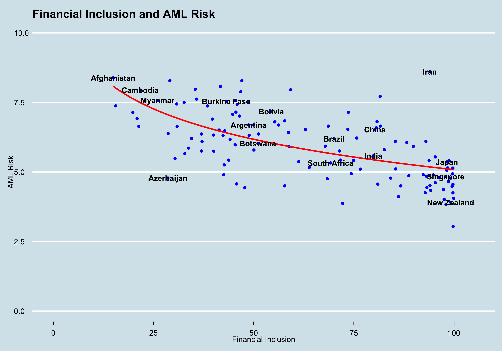

# Financial Inclusion and Money Laundering Risk

  

This project explores the relationship between financial inclusion and money laundering risk.

## Definitions
* Financial inclusion: the extent to which a country's citizens are included in the formal economy. There are many measures of financial inclusion. For simplicity, this project uses only one measure: the percentage of a country's adult population own a bank account. 
* Money laundering risk: the risk that money laundering occurs in a country. Each country is ranked on a scale of 0-10, with a score of 0 indicating that the country has a very low money laundering risk, and 10 indicating a very high money laundering risk.

## Sources
Financial inclusion data are taken from the World Bank's [Global Financial Inclusion (Global Findex) Database](https://datacatalog.worldbank.org/dataset/global-financial-inclusion-global-findex-database)

Financial crime risk data are taken from the Basel Institute on Governance's [AML Index](https://www.baselgovernance.org/basel-aml-index/public-ranking)

## Hypothesis 
_Financial inclusion and money laundering risk are negatively correlated. That is, the more financial inclusion that a country has, the lower will be its money laundering risk._

Therefore, the null hypothesis is:
_The correlation between financial inclusion and money laundering risk is equal to or greater than zero._

To test significance, I will use the standard significance measure of 0.05. If the P value is below 0.05, then the null hypothesis can be rejected. 

## Results
As can be seen from the graph above, there is a negative correlation. The correlation coefficient is __-0.6334079__ (Pearson Correlation Coefficient)

The effect is statistically significant: the P value is __0.000000000000001733__. 

---

## File Structure
Here is the order in which the project was constructed:
1. `Findex.Rmd` - importing and cleaning the Financial Inclusion data
2. `AmlRanking.Rmd` - importing and cleaning the AML Risk data
3. `CombinedData.Rmd` and `CombiningDataTakeTwo.Rmd` - combining the Financial Inclusion and AML Risk data
4. `findexAmlRiskDataViz.Rmd` - creating a scatterplot to show the data
